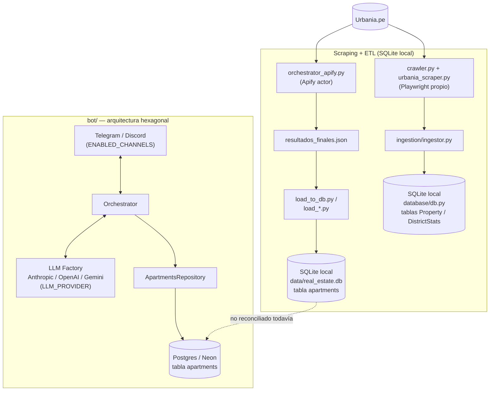

# Scrapper

Extrae listados de departamentos y casas de Urbania.pe (Lima) y los carga a una base de
datos local, que luego alimenta al [Asistente de Ventas Inmobiliario](../README.md).

## Origen y visión

Este scraper nació como parte de un producto más ambicioso: un "copiloto" inmobiliario que
no solo lista propiedades sino que razona sobre el mercado — detecta oportunidades
subvaloradas, compara precio por m² entre distritos, y señala cuando una descripción no es
consistente con el precio real. Casos de uso que motivaron qué datos capturar:

- **Análisis de oportunidad por link:** dado un anuncio, calcular su precio/m² y compararlo
  contra el promedio de su distrito ("está 10% por debajo del promedio en Miraflores").
- **Búsqueda con razonamiento:** no solo filtrar por zona/presupuesto/habitaciones, sino
  justificar por qué una opción es mejor que otra.
- **Comparativas por distrito:** qué zona tiene el precio/m² más bajo dado un set de
  distritos.
- **Detección de anomalías:** alertar si el precio no corresponde a los metrajes o
  amenities descritos.

El alcance del MVP se redujo a **solo scraping y base de datos** (ver Historial abajo). El
bot conversacional sí se construyó, pero con una arquitectura distinta a la planteada
originalmente aquí (puertos y adaptadores, Postgres en Neon, proveedor de LLM
intercambiable) — vive en [`bot/`](../bot/); ver el [README del proyecto](../README.md)
para esa arquitectura actual.

## Arquitectura actual

Versión actualizada del diagrama de `DESIGN.md`: no hay un solo pipeline sino dos rutas de
extracción que terminan en SQLite local, y un bot separado que lee de Postgres. La línea
punteada marca la brecha pendiente — hoy nada mueve datos automáticamente de un lado al otro
(ver la nota en la sección siguiente).



## Qué hay en esta carpeta

Dos formas de extraer datos, y dos formas de cargarlos.

**Extracción**
- `orchestrator_apify.py` — recorre 9 distritos de Lima × 2 operaciones (venta/alquiler) ×
  2 tipos de propiedad (departamento/casa) contra el actor de Apify
  `sian.agency/urbania-property-scraper` (evita el bloqueo de Cloudflare de Urbania.pe),
  descarta anuncios de proyectos en construcción, y guarda todo en `resultados_finales.json`.
- `crawler.py` + `urbania_scraper.py` — alternativa propia con Playwright +
  `playwright-stealth`: `crawler.py` descubre links de propiedades en una página de
  resultados de búsqueda; `urbania_scraper.py` extrae el detalle de una propiedad
  individual dado su link. `orchestrator.py` encadena ambos con el pipeline de ingesta
  (`ingestion/ingestor.py`) para ir de link a fila en la base en un solo paso.

**Carga**
- `load_to_db.py` — mapea `resultados_finales.json` (formato Apify) a la tabla `apartments`
  y la carga al SQLite local del proyecto (`../data/real_estate.db`).
- `load_alquiler.py`, `load_casa_alquiler.py`, `load_casa_venta.py`, `load_venta.py` —
  cargas puntuales de lotes de listados pegados a mano (no vía Apify), uno por combinación
  operación×tipo, al mismo SQLite local.

**Nota:** estos loaders escriben al SQLite local (`../data/real_estate.db`), no a la base
Postgres (Neon) que usa el bot en producción — ver "Estado actual / pendientes" en el
[README del proyecto](../README.md) para cómo se pobló esa base y qué falta reconciliar
entre ambos pipelines.

## Cómo correr

Requiere las dependencias del proyecto (`pip install -r ../requirements.txt`) y, para el
crawler propio, los binarios de Playwright (`playwright install chromium`). El token de
Apify va en `../.env` (`APIFY_API_TOKEN=...`).

```bash
# Desde projects/asistente_ventas_inmobiliario/

# Extracción vía Apify + carga (CWD en scrapper/: usan rutas relativas a
# resultados_finales.json y ../data/real_estate.db)
cd scrapper
python orchestrator_apify.py
python load_to_db.py
cd ..

# Extracción propia con Playwright (CWD en la raíz del proyecto: usa imports
# absolutos hacia scrapper/ e ingestion/)
python -m scrapper.orchestrator
```

## Historial de cambios

- **14/07/2026**: ajuste de alcance a solo scraping + base de datos; fix de integración
  `playwright-stealth`; integración de Apify (`sian.agency/urbania-property-scraper`) para
  evitar el bloqueo de Cloudflare; `orchestrator_apify.py` recorriendo distritos
  automáticamente; `load_to_db.py` cargando ~300 propiedades según el esquema del repo.
